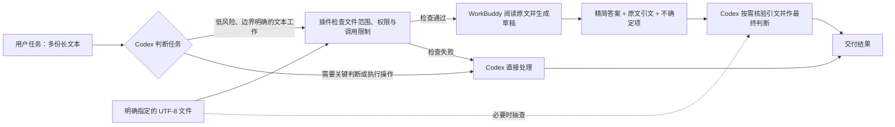

# WorkBuddy Delegate

> Community / experimental · Windows-first · 2026-09-23 reliability update

WorkBuddy Delegate is a local Codex plugin that sends **bounded, low-risk text work** to an existing WorkBuddy installation, then returns a small, inspectable draft for Codex to verify. It is designed for extraction, summarization, classification, translation, rewriting, and code drafts—not autonomous decisions or external actions.

中文：这是一个 Windows 优先的 Codex 社区插件，将边界清晰、低风险的文本工作交给本机已有的 WorkBuddy。主任务仍负责核验与最终判断。

## 工作流程与 Token 目标



**设计目标：**让 WorkBuddy 承担简单但耗费大量阅读上下文的提取、摘要、分类、翻译和改写工作。这样，Codex 主任务通常只需接收任务说明、精简草稿和核验所需的引文，而不必把全部文件内容放入自己的上下文。WorkBuddy 本身仍会消耗模型用量；实际节省多少 Codex Token、总成本和质量，需要用同一批任务做配对测量，不能由流程图保证。

## What it does

- Packages a Codex skill and a dependency-free local MCP server.
- Reads only explicit UTF-8 files beneath user-managed `allowed_roots`.
- Blocks common credential/config paths and strips secret-like inherited environment variables.
- Applies daily call, input-size, timeout, cache, and retention limits.
- Uses no copied API key: authentication stays in WorkBuddy.
- Stores small local result artifacts for inspection and labels them `needs_main_agent_review`.

It does **not** intercept every prompt before Codex sees it, guarantee savings or equal quality, edit files, run worker tools, or publish/send anything.

## Requirements

- Windows 10/11
- A current local Codex build with Agent Plugins v1 support (tested on `codex-cli 0.155.0-alpha.2.6`)
- Python 3.10+
- Node.js available on `PATH`
- WorkBuddy installed and signed in

The adapter uses WorkBuddy's bundled CodeBuddy CLI, which is not a documented stable public API. A WorkBuddy update may require a compatibility update here.

## Install from GitHub

```powershell
codex plugin marketplace add renyuxin6666-tech/codex-workbuddy-delegate --ref main
codex plugin add workbuddy-delegate@renyuxin-tools
```

Restart the Codex desktop app and open a new task. Then ask:

> Show WorkBuddy Delegate status and its manager command.

The first file-based delegation needs an allowed root. Preserve the complete returned manager command (including configuration and state paths), then append the subcommand:

```powershell
python "<installed-plugin>\scripts\manage.py" --config "<status.config_path>" --state-dir "<status.state_path>" roots add "D:\path\to\your\project"
python "<installed-plugin>\scripts\manage.py" --config "<status.config_path>" --state-dir "<status.state_path>" self-test
```

Provided text can be dry-run without an allowed file root. No manager command reads or prints API keys.

## Example prompts

- “Check whether summarizing these five notes is safe to delegate. If yes, use WorkBuddy and verify the cited excerpts.”
- “Show WorkBuddy Delegate status and this week's local invocation count.”
- “Use WorkBuddy for a first-pass translation of these allowed Markdown files; keep the final edit in Codex.”

## Management

```powershell
python plugins/workbuddy-delegate/scripts/manage.py doctor
python plugins/workbuddy-delegate/scripts/manage.py config init
python plugins/workbuddy-delegate/scripts/manage.py config set model auto
python plugins/workbuddy-delegate/scripts/manage.py config set daily_call_limit 10
python plugins/workbuddy-delegate/scripts/manage.py roots add "D:\project"
python plugins/workbuddy-delegate/scripts/manage.py usage --days 7
python plugins/workbuddy-delegate/scripts/manage.py cache prune
```

By default, portable installs place config and runtime state under the plugin's managed `${PLUGIN_DATA}` directory. Direct script use falls back to `%LOCALAPPDATA%\WorkBuddyDelegate`.

After setup, call the native `workbuddy_status` and verify that its `allowed_roots`
and model match the changes. If the manager and MCP disagree, they are reading
different configuration paths; use the explicit path arguments above. Do not
remove the allowlist or disable the sandbox to fix this. Shell fallback commands
may need scoped host approval to access WorkBuddy's installation and login.

To require approval for real delegation while auto-approving read-only status tools, use Codex's plugin-scoped MCP policy. See the current [OpenAI plugin packaging documentation](https://developers.openai.com/plugins/build/plugins) because config keys may evolve.

## Routing boundary

Good candidates:

- First-pass summaries of several non-sensitive notes
- Exact-field extraction with source quotations
- Low-stakes classification or translation batches
- Rewrite variants and unapplied code drafts

Keep in Codex:

- Final research claims, evidence adjudication, or literature novelty
- Medical, legal, financial, admissions, safety, or employment decisions
- Secrets, credentials, hidden config, or unrestricted filesystem reading
- File changes, deployments, messages, purchases, or other external actions
- Tasks whose authority or currentness is ambiguous

## Evaluation snapshot

The bounded prototype scored **93.18/100** on one synthetic 22,049-character authority/version extraction fixture, but failed the strict completeness gate because it captured only **6/11** superseded historical relations. It captured current constraints **5/5**, unresolved issues **1/1**, and exact evidence **6/6**, with no accepted prompt-injection instruction. This supports current-state extraction with Codex review—not complete historical auditing or generalized performance. See [BENCHMARK.md](BENCHMARK.md).

## Security and privacy

Read [PRIVACY.md](PRIVACY.md) and [SECURITY.md](SECURITY.md) before adding sensitive projects. Results and quoted excerpts are stored locally until retention or pruning removes them. Source content is sent to the model/provider configured in WorkBuddy.

## Development

```powershell
python -m unittest discover -s tests -v
python plugins/workbuddy-delegate/scripts/manage.py self-test
python C:\Users\<you>\.codex\skills\.system\plugin-creator\scripts\validate_plugin.py plugins\workbuddy-delegate
python C:\Users\<you>\.codex\skills\.system\skill-creator\scripts\quick_validate.py plugins\workbuddy-delegate\skills\workbuddy-delegate
```

## Status

This GitHub release is a local/repo marketplace plugin. It is **not** an official WorkBuddy integration and is not listed in the universal OpenAI Plugins Directory; public directory submission normally expects a public HTTPS MCP endpoint, while this plugin must access the user's local WorkBuddy installation.

MIT licensed. WorkBuddy, CodeBuddy, Codex, OpenAI, and their marks belong to their respective owners. This community project is not affiliated with or endorsed by them.

## Local dispatch reliability update

The manager command returned by native status includes the exact config and state paths;
keep these arguments when adding an approved project root. Terminal defaults may refer
to a different configuration. `dry_run` now verifies CLI discovery, runtime-directory
write access and the usage ledger without calling a model or consuming invocation quota.
It does not verify login or network connectivity. Permission errors return scoped repair
instructions; CLI failures return sanitized diagnostic categories, never raw output.
After reinstalling, start a new Codex task to load the updated MCP process.
